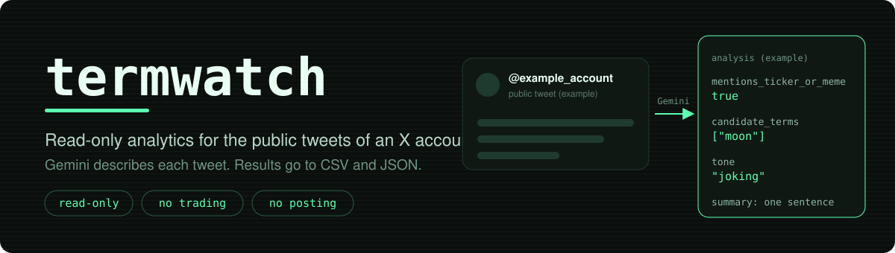
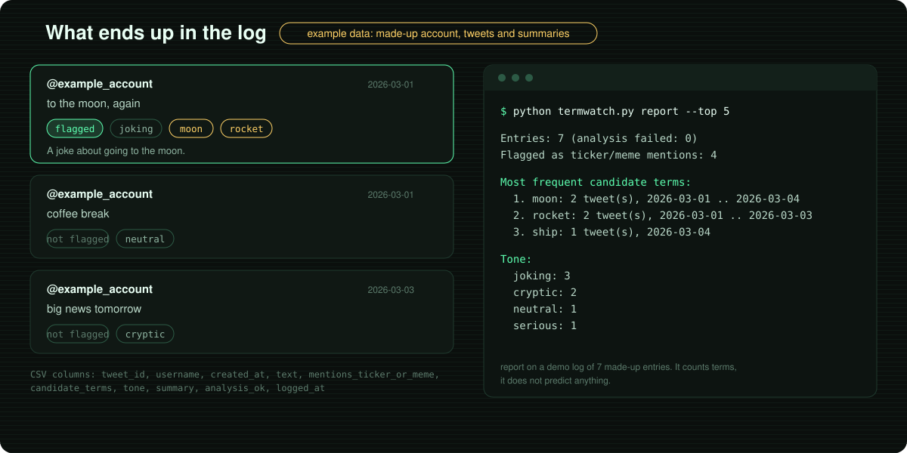

  

# termwatch

A read-only analytics tool for the public tweets of an X account. It fetches new tweets through the X API, asks Gemini for a short descriptive analysis of each one (does it mention a ticker, a coin or a possible meme term, what is the tone), and logs everything to CSV and JSON. A report command counts the most frequent terms.

It does not trade, does not touch any wallet and does not post or reply. The output is meant to be read by a person. It is a description of tweets, not financial advice.

## What it does

- Fetches only tweets newer than the last one it saw, so repeated checks stay cheap
- Sends each new tweet to Gemini and stores four things: `mentions_ticker_or_meme`, `candidate_terms`, `tone`, `summary`
- Writes every result to `sentiment_log.json` and `sentiment_log.csv`
- Remembers its place in `state.json`, so a restart does not analyze old tweets again
- Watches one or several accounts
- Waits until the X rate limit resets when it gets HTTP 429
- Retries Gemini requests on network errors, HTTP 429 and HTTP 5xx; if analysis still fails, it logs a neutral placeholder with `analysis_ok` set to `false`
- `report` summarizes the log: flagged tweets, tones and the most frequent candidate terms

## How it works

## Setup

You need Python 3.10 or newer, an X API bearer token ([developer.x.com](https://developer.x.com)) and a Gemini API key ([aistudio.google.com/apikey](https://aistudio.google.com/apikey)).

    git clone https://github.com/vantacorehq/termwatch.git
    cd termwatch
    pip install -r requirements.txt

Copy `.env.example` to `.env` and fill in both keys:

    X_BEARER_TOKEN=your_x_bearer_token_here
    GEMINI_API_KEY=your_gemini_api_key_here

You can also set them as environment variables. The `.env` file is ignored by git.

## Usage

Check that your Gemini key works:

    python termwatch.py analyze --text "example text to analyze"

Watch an account, one check every 15 minutes (stop with Ctrl+C):

    python termwatch.py run --user example_account

Other ways to run:

    python termwatch.py run --user example_account --once
    python termwatch.py run --user first_account --user second_account
    python termwatch.py run --user example_account --from-now --exclude-retweets --exclude-replies
    python termwatch.py run --user example_account --interval 1800 --max-tweets 10

Summarize what has been logged:

    python termwatch.py report
    python termwatch.py report --top 20 --format json

Options of `run`: `--user` (repeat for several accounts), `--interval` (seconds, default `900`), `--max-tweets` (5 to 100, default `5`), `--once`, `--from-now` (the first check of an account skips its existing tweets), `--exclude-retweets`, `--exclude-replies`, `--data-dir` (default `data`), `--model` (default `gemini-flash-latest`).

Options of `report`: `--data-dir`, `--top` (default `10`), `--format` (`text` or `json`).

## What you get

The picture shows a made-up account, made-up tweets and a demo log of 7 entries. The report lists term counts. It does not predict anything.

## Good to know

- X API limits depend on your plan. The default interval of 15 minutes is conservative; lower it only if your plan allows more requests.
- Data lives in the `data` folder: `sentiment_log.json`, `sentiment_log.csv` and `state.json`.
- Gemini output is descriptive and can be wrong. Do not treat flagged terms as buy or sell signals.
- Tweet text is sent to the Gemini API, so use it only for public tweets you are allowed to analyze.
- Network calls are mocked in the tests. The real X and Gemini APIs are not called by the test suite.

## Tests

    python -m unittest discover -s . -p "test_*.py"

63 tests cover the X and Gemini clients (with retries and rate limits), logging, state, the tracker loop, the report and the command line. Tested with Python 3.12.

## Project files

| File | Purpose |
| --- | --- |
| `termwatch.py` | Commands and options, run this file |
| `tw_tracker.py` | One check and the main loop |
| `tw_x_client.py` | X API v2: user lookup and timeline |
| `tw_gemini_client.py` | Gemini analysis with retries |
| `tw_storage.py` | JSON log, CSV log, state file |
| `tw_report.py` | Summary of the log |
| `tw_config.py` | API keys from environment or `.env` |
| `test_*.py`, `helpers_fakes.py` | Unit tests |
| `assets/` | Images for this README |

## Need a custom monitoring tool?

Open for freelance work: data collection and automation projects. DM me on X: [@vantacorehq](https://x.com/vantacorehq)
